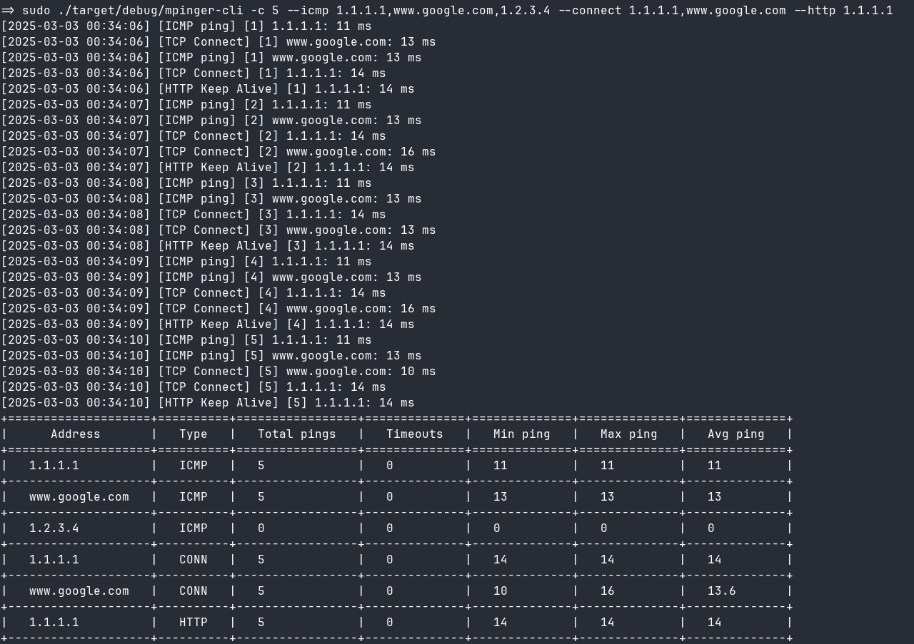

# MPinger

MPinger is a versatile multi-host roundtrip time (ping) measure tool that employs a variety of methods to efficiently ping destination hosts

Supported ping methods:

* ICMP ping
* TCP connection
* HTTP request

## Console client

`mpinger-cli` is a console client, it prints a fancy summary table after all pings are sent (or Ctrl+C is pressed).

```bash
Usage: mpinger-cli [OPTIONS]
Options:
  -d, --debug
  -c, --count <COUNT>        Number of pings to send, 0 for infinite pings (press Ctrl+C to stop) [default: 5]
  -i, --interval <INTERVAL>  Interval between pings in ms [default: 1000]
      --icmp <ICMP>          List of comma separated addresses to perform ICMP pings
      --connect <CONNECT>    List of comma separated addresses to perform TCP connect pings (default port 80)
      --http <HTTP>          List of comma separated addresses to perform HTTP keepalive pings (default port 80)
  -h, --help                 Print help
  ```

Example:

* send 5 pings to `1.1.1.1`, `www.google.com`, `1.2.3.4` hosts using ICMP Echo method
* send 5 pings to `1.1.1.1`, `www.google.com` hosts using TCP connect method
* send 5 pings to `1.1.1.1` host using HTTP keepalive method

```bash
sudo mpinger-cli -c 5 --icmp 1.1.1.1,www.google.com,1.2.3.4 --connect 1.1.1.1,www.google.com --http 1.1.1.1
```



## TUI client
